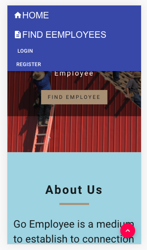
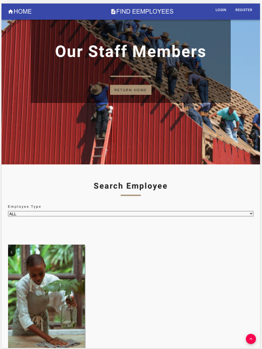
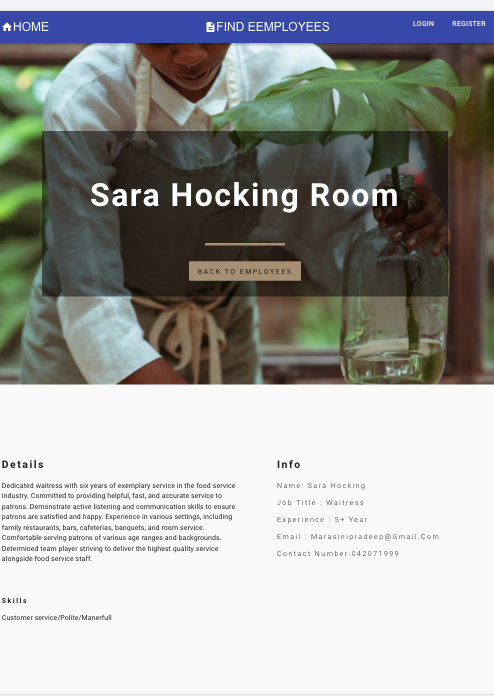
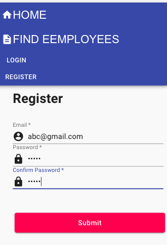
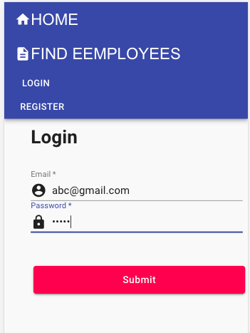
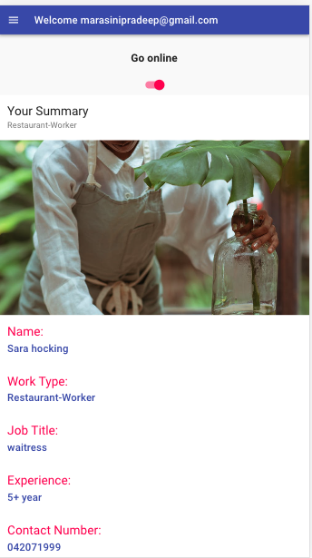
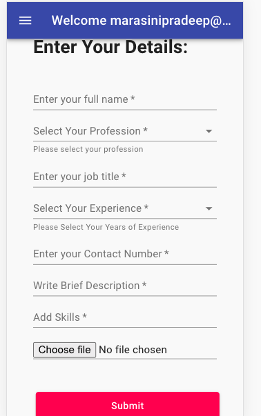
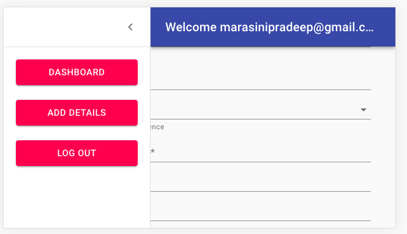
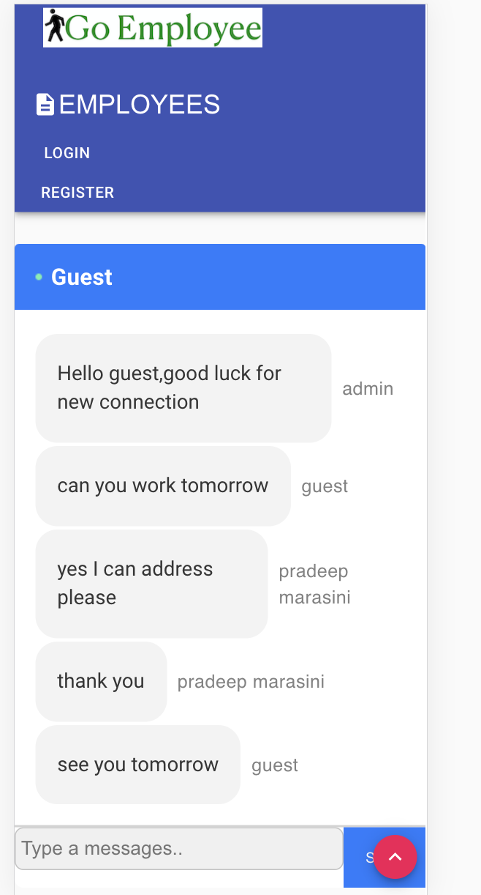
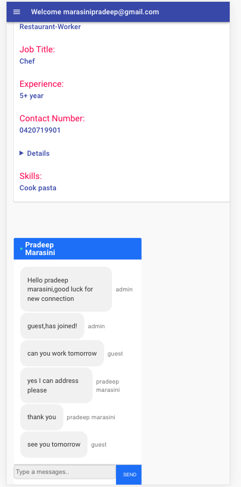

# GoEmployee

## Links

* [Description](#Description)

* [Design](#design)

* [Front End Technologies](#FrontEndTechnologies)

* [Back End Technologies](#BackEndTechnologies)

* [Demo URL](#DemoURL)

* [Contact](#Contact)

## Description
GoEmployee is a platform to establish a connection between job provider and job seeker mainly for small business like restaurant, cleaning and agricultures.As small industries have lack of budget for human resource system they always find difficulties connecting with right employees.So this application helps to find right employee for right businesses.Whenever the person who is looking employee they can always look in this web and find the right fit person for their business.

It consist of:-
* USER PORTAL
* EMPLOYEE PORTAL

# USER PORTAL
User portal has following pages:-
1. Home page :- This is the landing page and consist of brief description about the
findEmployee web app and the services it provides.

2. Find Employee page:- This page will list all the employees who are currently online from different filds.User can filter them immediately by categories.(farmer,cleaner and restaurant workers).

3. Connect Page : -When cliked on connect with certain employee it takes users to their personal page where user can read information about the employers.Also, this page has got chatting system to get further connection between them.

# EMPLOYEE PORTAL

1. Register :- Before anything new employers must register with their unique email id and password.Once registered ready for log in.

2. Login :-With unique email id and password employee can log in to employee dashboard.

* Employee Dashboard again further has 3 parts:

1. Summary section :- Employee will be able to see their profile.Also it has got online and offline button which make them to seen from potential job owners.When you put online employers will be able to communicate and expose themself on the user portal.

2. Details :- This field allows employers to update their information.

3. Log out :- When logged out employers are no more available.

# Design

The site is "polished."

* Mobile-first design

# User and Connected Employee Live Chat Demo

# FrontEndTechnologies

Following are the libraries and frameworks used in front end:-

1. React And React Hooks

2. Javascript

3. Material-UI

4. CSS

5. HTML

6. socket.io-client

# BackEndTechnologies

Following are the libraries and frameworks used in back end:-

1. Node Js

2. Express

3. Mongo DB

4. Moongoose

5. IO Socket

6. JWT authentication

## Live APP Link
<a href= "https://goemployees.herokuapp.com/">Click here for Live  link</a>

# DemoURL

<a href= "https://www.youtube.com/watch?v=BXcqKEGlIlA&feature=youtu.be">Click here for Demo  link</a>

# Contact
Email: marasinipradeep@gmail.com

Phone Number: (+61) 0420719901

Portfolio: <a href= "https://pradeep-marasini.herokuapp.com/">Click here for my portfolio</a>

Linkdin: <a href= "https://www.linkedin.com/in/pmarasini/">Click here for my linkdin</a>

Github:<a href= "https://github.com/marasinipradeep">Click here for my github repo</a>

